# Integrate LiteHRNet pose estimation model with Label Studio
## Set up Label Studio
1. Install Docker on your device.
1. Make sure you are in the directory `Label_Studio_ML/Label_Studio`. If not, use `cd` command to change directory to it.
    ```bash
    cd Label_Studio
    ```
1. Launch **Label Studio**. The `docker-compose.yaml` lanuches the application on port `8080`, create and mount directory `mydata` to it, as well as set some environment variables.
    ```bash
    docker compose up
    ```
   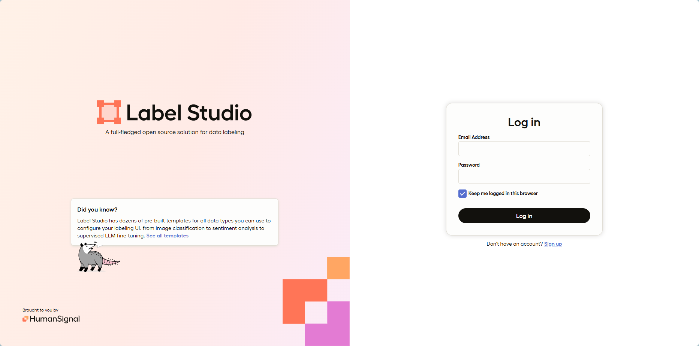
1. Access the application via `localhost:8080` on your browser.
1. Sign up and Sign in **Label Studio**.
1. Get `Access Token` to set up the ML backend for **Label Studio**.
   1. Select **Account & Settings**.
   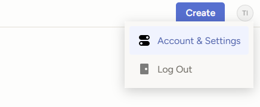
   1. Copy `Access Token`.
   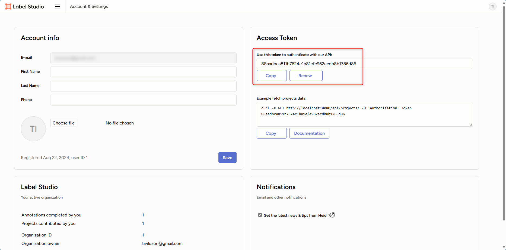
1. Create and set up a labeling project.
   1. Set project name and import local image dataset
   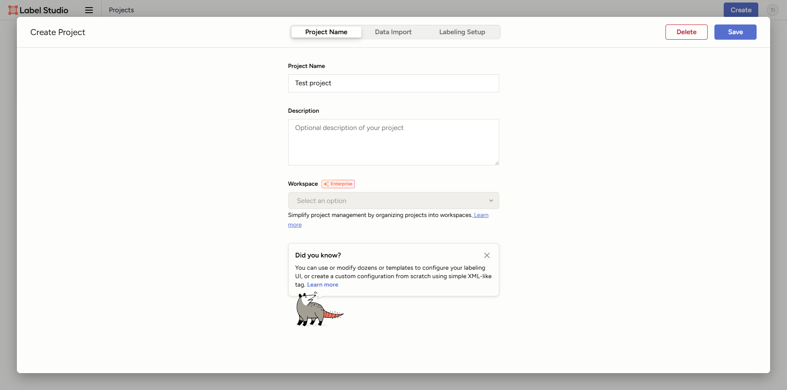
   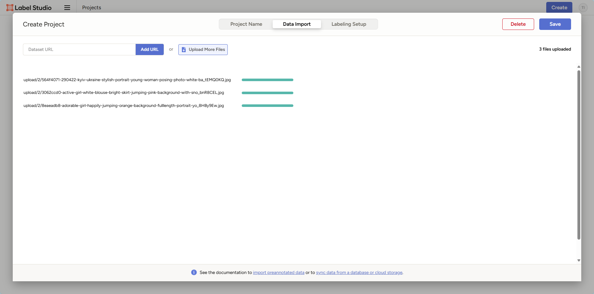
   2. Set up Labeling Interface with the content of file `annotation.xml`
   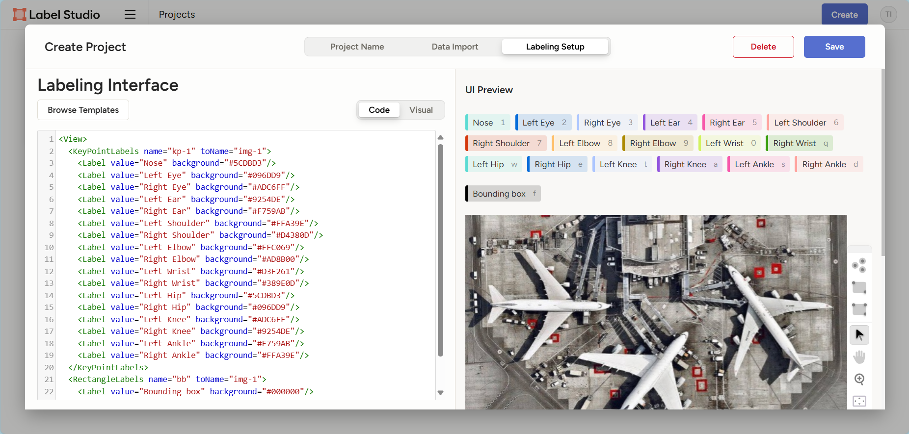
   
## Set up LiteHRNet ML Backend for Label Studiov
1. Change your working path to `Label_Studio_ML/LiteHRNet_ML_backed`.
1. Update 2 environment variables in the `docker-compose.yaml` file:
    - `LABEL_STUDIO_URL`: if **Label Studio** is launched via Docker on port **8080**, this can be kept as default `http://host.docker.internal:8080`. Else, use your local IP and corresponding port.
    - `LABEL_STUDIO_API_KEY`: this is the `Access Token` copied in the previous section.
1. Launch the `LiteHRNet model` as the Machine Learning backend for **Label Studio**. This application will run on port **9090** that deploys the model in file `Models/model_original_with_flip.onnx` that perform pose estimation for 17 body keypoints.
    ```bash
    docker compose up
    ```
1. On the **Label Studio** application, select your project and select `Settings`.
    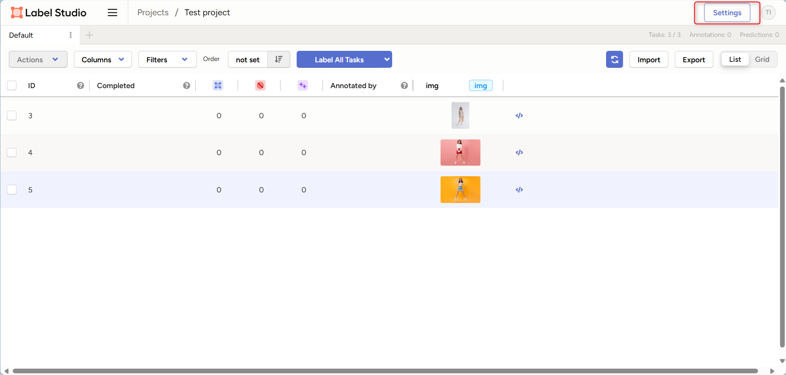
1. Select `Model` tab and `Connect Model` button.
    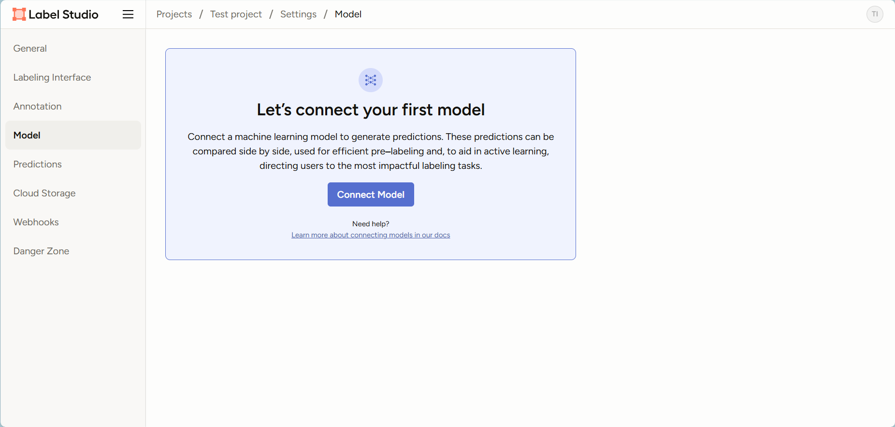
1. Fill the `Name`, `Backend URL` and enable `Interactive preaanotations`. Afterwards, click `Validate and Save`.
    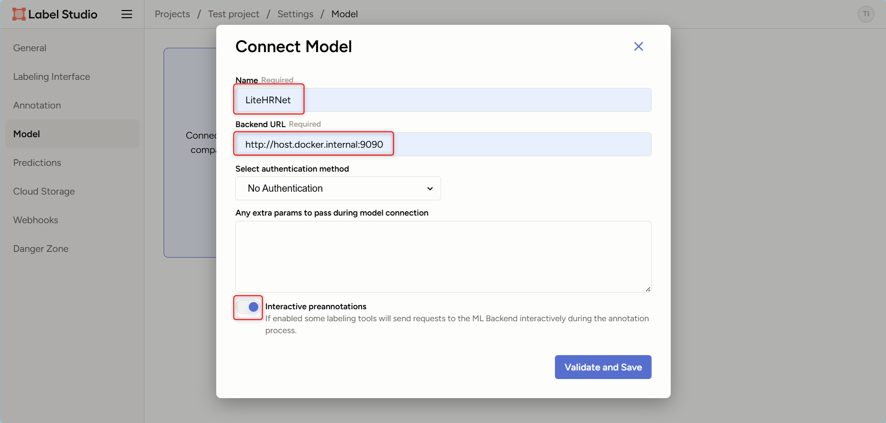
    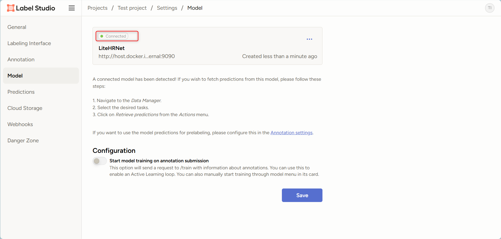
1. On tab `Annotation`, ensure `Prelabeling` is enabled with the correct backend model.
    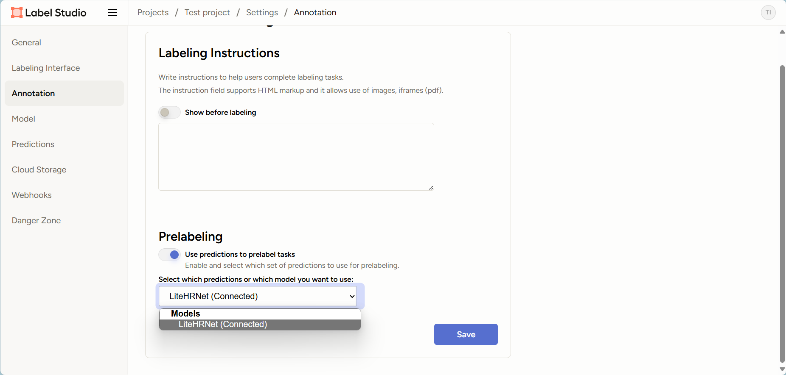
1. Return to your project and select each image for labeling. Enable `Auto-Annotation` and `Auto-Accept Suggestions`. Images should now be pre-annotated every time it's loaded. Refine the prediction to boost the labeling efficiency.
    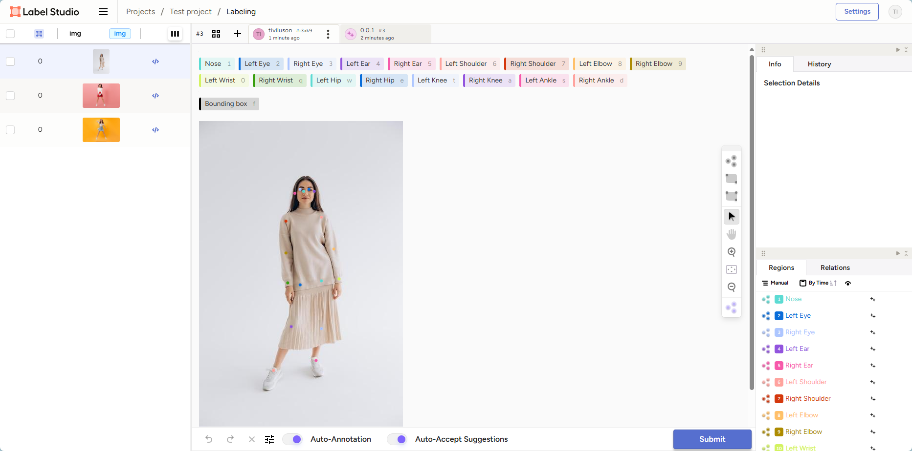